<div align="center">

<!-- ═══════════════════════════════════════════════════════════════ -->
<!--                    🐆 HERO TERMINAL — BENGAL MODE 🐆          -->
<!-- ═══════════════════════════════════════════════════════════════ -->

<a href="https://github.com/NitroD3">

</a>

<br>

<!-- Typing animations -->
<a href="https://github.com/NitroD3">

</a>

<br>

<!-- Quick badges -->
<a href="https://github.com/NitroD3"></a>


<br><br>

<a href="https://github.com/NitroD3"></a>
&nbsp;
<a href="https://github.com/NitroD3?tab=followers"></a>
&nbsp;


</div>

<!-- ═══════════════════════════════════════════════════════════════ -->

<!-- ═══════════════════════════════════════════════════════════════ -->

<div align="center">

## `> cat tech_stack.json 🐆`

</div>

<div align="center">

<details open>
<summary><b>⚔️ Backend — The Engine</b></summary>
<br>


<br>

```json
{
  "primary"    : ["PHP 8.x", "Laravel 11", "Python 3"],
  "secondary"  : ["Ruby", "Node.js", "Express"],
  "apis"       : ["REST", "GraphQL", "WebSocket"],
  "patterns"   : ["MVC", "Repository", "Service Layer"]
}
```

</details>

<details>
<summary><b>🎨 Frontend — The Face</b></summary>
<br>


<br>

```json
{
  "frameworks" : ["Next.js 14", "React 18", "Vue 3"],
  "styling"    : ["Tailwind CSS", "SASS", "Styled Components"],
  "3d_web"     : ["Three.js", "WebGL"],
  "state"      : ["Redux", "Pinia", "Zustand"]
}
```

</details>

<details>
<summary><b>📱 Mobile — The Touch</b></summary>
<br>


<br>

```json
{
  "cross"      : ["Flutter", "React Native"],
  "native"     : ["Swift (iOS)", "Kotlin (Android)"],
  "tools"      : ["Android Studio", "Xcode", "Firebase"]
}
```

</details>

<details>
<summary><b>🗄️ Databases — The Memory</b></summary>
<br>


<br>

```json
{
  "relational" : ["MySQL", "PostgreSQL", "SQLite"],
  "nosql"      : ["MongoDB", "Firebase Realtime DB"],
  "cache"      : ["Redis", "Memcached"],
  "orm"        : ["Eloquent", "Prisma", "Mongoose"]
}
```

</details>

<details>
<summary><b>🛡️ Security & Hacking — The Fangs 🐆</b></summary>
<br>


<br>

```json
{
  "injection"  : ["SQLi (Union/Blind/Error)", "NoSQLi", "Command Injection"],
  "xss"        : ["Stored", "Reflected", "DOM-based"],
  "advanced"   : ["SSRF", "CSRF", "IDOR", "JWT Abuse", "Race Conditions"],
  "evasion"    : ["WAF Bypass (Cloudflare)", "Rate Limit Bypass", "CAPTCHA Bypass"],
  "tools"      : ["Burp Suite Pro", "SQLMap", "Nmap", "Metasploit", "FlareSolverr"],
  "mindset"    : "Break it. Fix it. Own it. 🐆"
}
```

</details>

<details>
<summary><b>⚙️ DevOps & Infrastructure — The Spine</b></summary>
<br>


<br>

```json
{
  "containers" : ["Docker", "Docker Compose"],
  "servers"    : ["Nginx", "Apache", "O2Switch Dedicated"],
  "ci_cd"      : ["GitHub Actions", "Custom Scripts"],
  "dns_cdn"    : ["Cloudflare", "Let's Encrypt"],
  "monitoring" : ["Custom dashboards", "UptimeRobot"]
}
```

</details>

<details>
<summary><b>⛓️ Web3 & AI — The Future</b></summary>
<br>

```json
{
  "blockchain" : ["Solidity", "Web3.js", "Ethers.js"],
  "ai"         : ["OpenAI API", "LangChain", "GPT Integration"],
  "bots"       : ["Telegram Bot API", "Discord.js"],
  "automation" : ["Selenium", "Puppeteer", "FlareSolverr"]
}
```

</details>

</div>

<!-- ═══════════════════════════════════════════════════════════════ -->

<!-- ═══════════════════════════════════════════════════════════════ -->

<div align="center">

## `> ./snake --eat-contributions 🐍`

<br>

<picture>
  <source media="(prefers-color-scheme: dark)" srcset="https://raw.githubusercontent.com/NitroD3/NitroD3/output/github-snake-dark.svg" />
  <source media="(prefers-color-scheme: light)" srcset="https://raw.githubusercontent.com/NitroD3/NitroD3/output/github-snake.svg" />
  
</picture>

</div>

<!-- ═══════════════════════════════════════════════════════════════ -->

<!-- ═══════════════════════════════════════════════════════════════ -->

<div align="center">

## `> neofetch --github-stats 📊`

<br>

<a href="https://github.com/NitroD3">

</a>
<a href="https://github.com/NitroD3">

</a>

<br>

<a href="https://github.com/NitroD3">

</a>
<a href="https://github.com/NitroD3">

</a>

</div>

<!-- ═══════════════════════════════════════════════════════════════ -->

<!-- ═══════════════════════════════════════════════════════════════ -->

<div align="center">

## `> ls -la /empire/ 🌐`

</div>

<div align="center">

<details>
<summary><b>🌐 90+ Sites — The Digital Empire</b></summary>
<br>

```
drwxr-xr-x  empire/
├── 🟢 jaidurab.com .............. VOD Platform ......... Laravel + Vue.js
├── 🟢 tourak-digital.com ........ Digital Agency ........ Next.js + Laravel
├── 🟢 glamboss.love ............. Entertainment Hub ..... PHP + Custom CMS
├── 🟢 followersexpress.com ...... SMM Panel ............. Laravel + API
├── 🟢 easykunik.com ............. E-commerce ............ WooCommerce
├── 🟢 bengalcats.fr ............. Niche Community 🐆 .... WordPress
├── 🟢 x-casting.fr .............. Casting Platform ...... Laravel
├── 🟢 as3poker.com .............. Gaming Platform ....... PHP Custom
├── 🟢 viplimousine.paris ........ VTC Luxury ............ Laravel
├── 🟢 lilysium.com .............. Lifestyle Brand ....... Next.js
├── 🟢 barber-avenue.com ......... Booking System ........ Laravel
├── 🟢 myvtc.fr .................. Transport Service ..... Laravel
├── 🟢 + 75 more sites ........................................... 
│
└── 📁 Infra: O2Switch Dedicated · Custom CI/CD · 90+ Private Repos
```

</details>

<details>
<summary><b>🛡️ cat /arsenal/weapons.conf</b></summary>
<br>

```bash
# ═══════════════════════════════════════════
#  SECURITY ARSENAL — Break it before they do
# ═══════════════════════════════════════════

[INJECTION]
sql_injection    = "Union-Based | Blind | Error-Based | Time-Based"
nosql_injection  = "MongoDB | Redis"
command_inject   = "OS Command | SSTI"

[XSS_ATTACKS]
stored           = true
reflected        = true
dom_based        = true

[ADVANCED]
ssrf             = "Internal network scanning"
csrf             = "State-changing request forgery"
idor             = "Direct object reference abuse"
jwt_abuse        = "Algorithm confusion | Key leakage"
race_conditions  = "TOCTOU | Double-spend"
oauth_misconfig  = "Redirect URI manipulation"

[EVASION]
waf_bypass       = "Cloudflare | Akamai | ModSecurity"
rate_limit       = "Header rotation | IP cycling"
captcha_bypass   = "FlareSolverr | 2Captcha"

[TOOLS]
primary          = "Burp Suite Pro | SQLMap | Nmap"
secondary        = "Metasploit | Hydra | ffuf | Gobuster"
custom           = "FlareSolverr | Custom Python scripts"

# "The best defense is a good offense." — NitroD3 🐆
```

</details>

</div>

<!-- ═══════════════════════════════════════════════════════════════ -->

<!-- ═══════════════════════════════════════════════════════════════ -->

<div align="center">

## `> git log --oneline --graph /life/ 📅`

</div>

<div align="center">

```
* d961104 (HEAD -> 2026) 👑 90+ sites · 90+ repos · EMPIRE MODE
* a8f2bc3 (2024)         🔴 TRK TEAM formed — 50+ sites
* 7c1e4d9 (2022)         💰 AT DIGITAL LLC founded — business mode
* 3b9f0a2 (2020)         🛡️  Bug Bounty Hunter mode — breaking things
* e5d1c87 (2018)         🚀 Full Stack mastery — PHP, JS, Python
* 9a4f2e1 (2014)         🌐 First freelance clients — getting paid
* 2c8b6d3 (2010)         💻 Building websites for fun — self-taught grind
* 0000001 (2006)         🎒 First lines of code — age 9 — the spark ignites
```

</div>

<!-- ═══════════════════════════════════════════════════════════════ -->

<!-- ═══════════════════════════════════════════════════════════════ -->

<div align="center">

## `> cat /2026/objectives.md 🎯`

</div>

<div align="center">

<details>
<summary><b>🎯 2026 Operations — Classified 🔴</b></summary>
<br>

```yaml
# ═══════════════════════════════════
#  2026 OPS — CLASSIFIED 🔴
# ═══════════════════════════════════

empire:
  - Scale 90+ sites to max profitability
  - Automate deployments with custom CI/CD
  - Build monitoring dashboard for all sites

development:
  - Ship Flutter mobile apps
  - Advance Laravel VOD platform (jaidurab.com)
  - Telegram & Discord bot ecosystem
  - SaaS product launch

security:
  - Increase bug bounty payouts
  - Build automated recon pipeline
  - CVE hunting season 🐆

revenue:
  - "90+ sites = 90+ income streams"
  - Crypto integration (Coinbase Commerce)
  - Subscription models everywhere

trk_team:
  motto: "Build in darkness. Ship in silence."
  status: ACTIVE 🔴
  sleep: null  # undefined behavior
```

</details>

</div>

<!-- ═══════════════════════════════════════════════════════════════ -->

<!-- ═══════════════════════════════════════════════════════════════ -->

<div align="center">

## `> cat /links/connect.sh 🤝`

<br>

<a href="https://tourak-digital.com"></a>
<a href="https://jaidurab.com"></a>
<a href="https://glamboss.love"></a>
<a href="https://followersexpress.com"></a>
<a href="https://bengalcats.fr"></a>

<br><br>

```
╔══════════════════════════════════════════════════════════════╗
║                                                              ║
║   "On ne dort pas. On code. On hack. On build.              ║
║    On ship. On conquer."                                     ║
║                                         — TRK Team 🔴 🐆    ║
║                                                              ║
╚══════════════════════════════════════════════════════════════╝
```

<br>


<br><br>

<!-- Footer SVG -->


</div>
